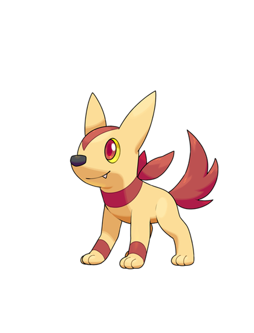
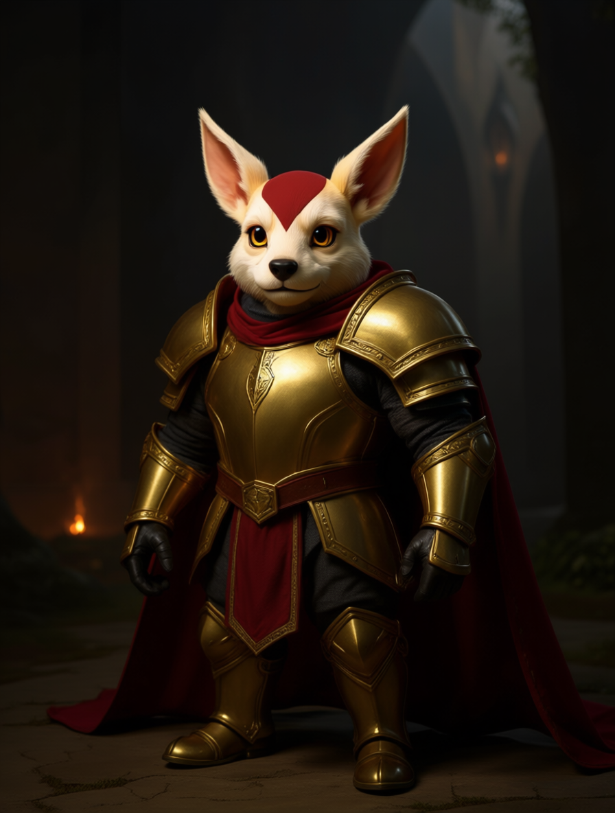
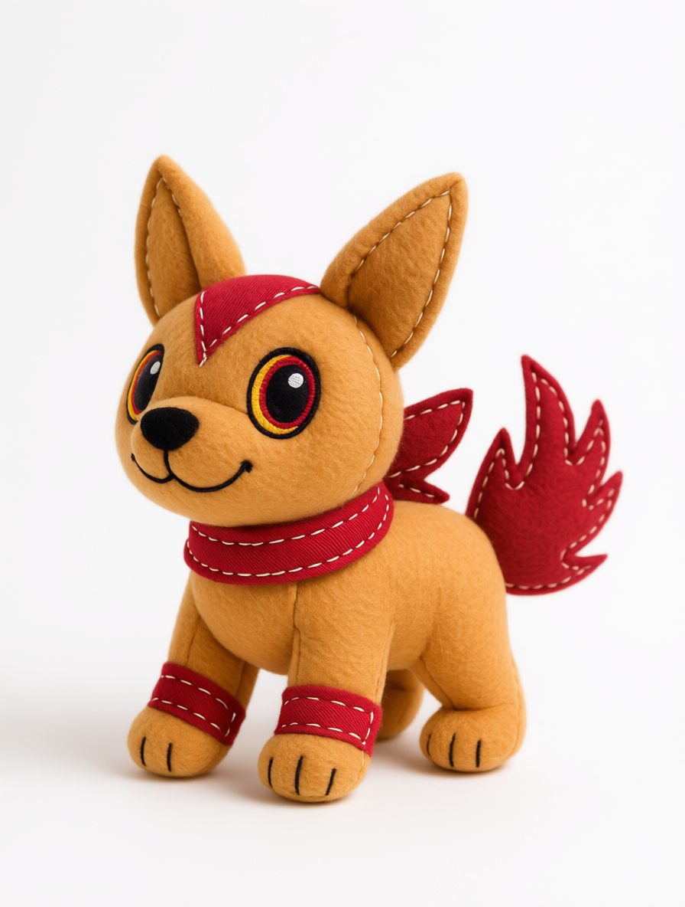
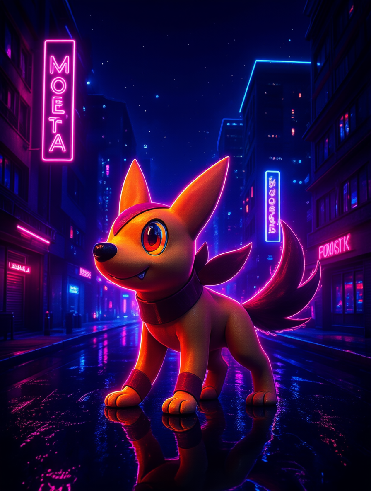

# Pentagon Games — Image Remix API

Turn an image you own into an **identity-preserving derivative** — restyle it, re-costume it, or drop it into a new scene, while keeping the subject recognizable.

Powered by [Qwen-Image-Edit](https://huggingface.co/Qwen/Qwen-Image-Edit) (Apache-2.0), self-hosted on our own GPUs.

```
Base URL:  https://imgen.pentagon.games
Auth:      x-api-key: <YOUR_API_KEY>
```

> You need an API key to use this. Request one from the Pentagon Games team.

---

## Example

| Input | → Knight | → Plush | → Cyberpunk |
|---|---|---|---|
|  |  |  |  |

Same creature — face, ears, markings, colors preserved — across three very different transformations.

---

## Endpoints

### `GET /health`
No auth. Liveness check.
```json
{ "status": "ok", "model": "Qwen-Image-Edit" }
```

### `POST /v1/edit`
Auth required (`x-api-key` header). `multipart/form-data`.

| Field | Type | Required | Default | Notes |
|---|---|---|---|---|
| `prompt` | string | ✅ | — | What to make. Be explicit about *keeping identity*. |
| `image` | file | one of | — | The source image (upload). |
| `image_url` | string | one of | — | …or a URL to fetch the source image from. |
| `negative_prompt` | string | | `blurry, low quality, deformed` | What to avoid. |
| `steps` | int | | `35` | Denoising steps. Higher = slower, more refined. |
| `cfg` | float | | `4.0` | Guidance strength. |
| `seed` | int | | `7` | Fix for reproducible output. |

**Returns:** `image/png` bytes (the derivative).

Provide **either** `image` (file) **or** `image_url`.

---

## Quick start

**curl**
```bash
curl -X POST https://imgen.pentagon.games/v1/edit \
  -H "x-api-key: $IMGEN_KEY" \
  -F "image=@my_pet.png" \
  -F "prompt=turn this creature into a heroic knight in golden armor, keep it a creature with its animal head, ears and colors" \
  -o derivative.png
```

**Python** — see [`examples/remix.py`](examples/remix.py)
**Node.js** — see [`examples/remix.js`](examples/remix.js)
**Bash** — see [`examples/remix.sh`](examples/remix.sh)

---

## Prompting tips

The model follows your prompt literally, so a few words change the outcome:

- **Keep it a creature.** "Knight" alone can *humanize* an animal subject. Add
  `keep it a creature with its animal head and body, anthropomorphic, not human`
  and put `human face, human person` in `negative_prompt`.
- **Name what to preserve.** "keep its face, ears, colors and markings" anchors identity.
- **Two remix styles:**
  - *Instruction edit* — "put it in armor", "make it a plush toy" (preserves the subject).
  - *Restyle* — "in a neon cyberpunk city", "watercolor storybook style" (keeps subject, changes world/look).
- **Reproducibility:** fix `seed` to get the same result for the same input+prompt.

---

## Notes & limits

- **Latency:** ~30–60 s per image (single GPU, memory-offloaded). Requests are processed one at a time.
- **You must have rights to the input image.** This API creates derivatives of whatever you send it — send only images you own or are licensed to modify.
- **Model:** Qwen-Image-Edit, Apache-2.0. Self-hosted; no third-party image API in the path.

## Self-hosting

The server is a small FastAPI app around `diffusers`. See [`server/qwen_api.py`](server/qwen_api.py) and [`server/README.md`](server/README.md) to run your own instance.
